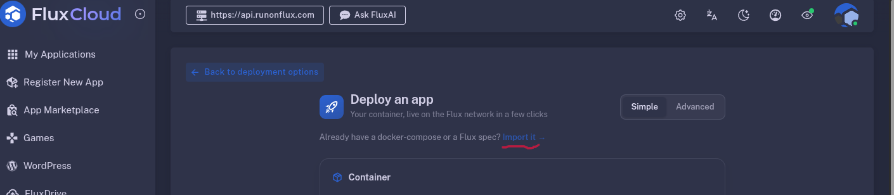
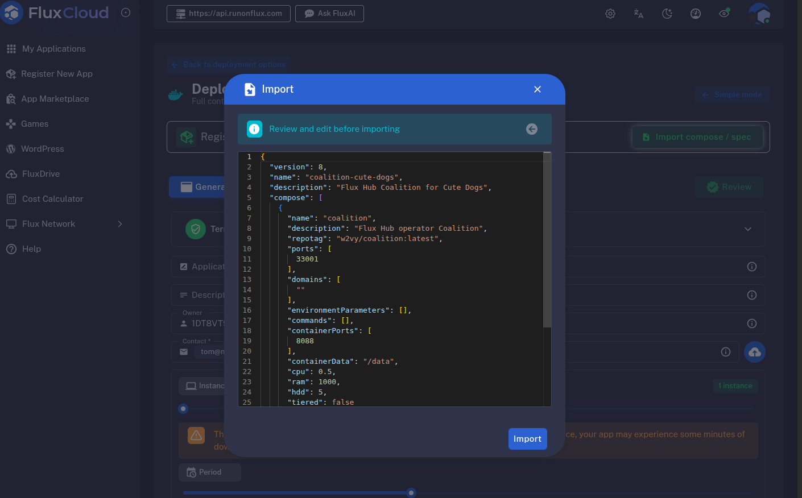
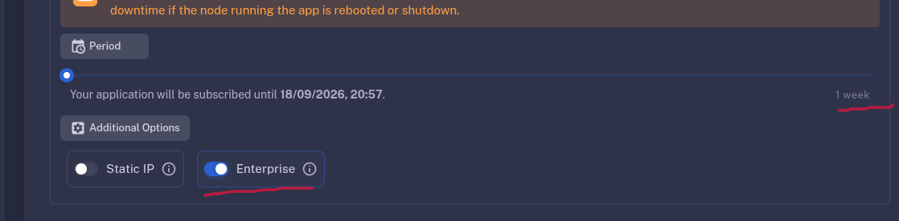
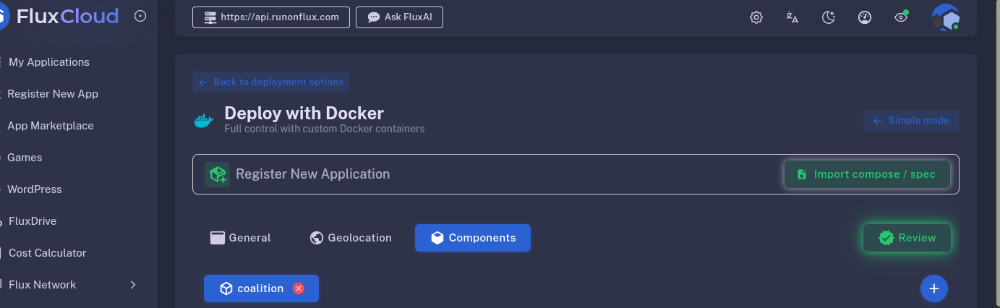
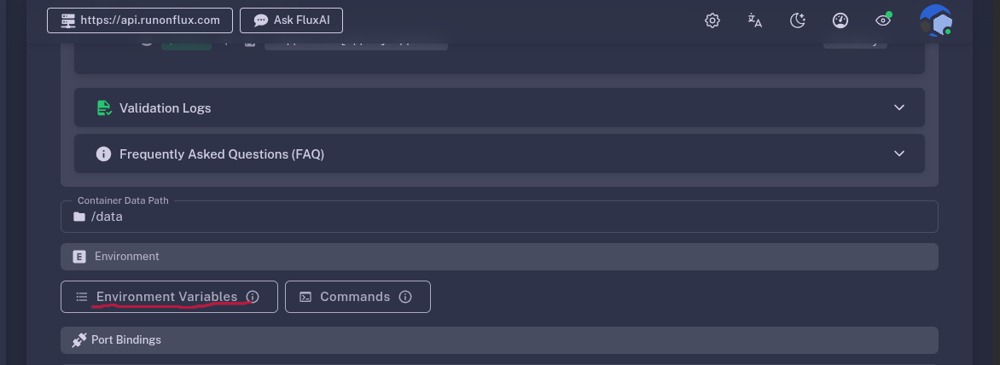
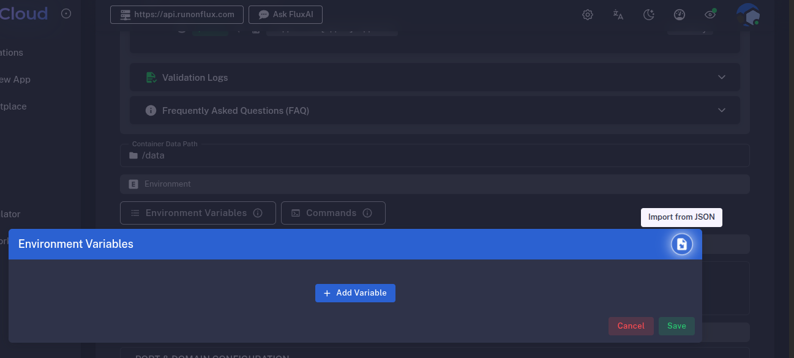
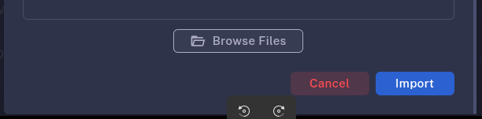
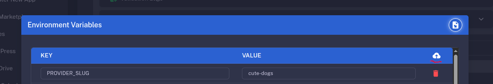
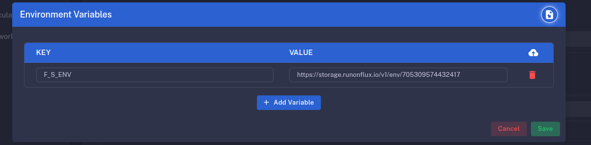
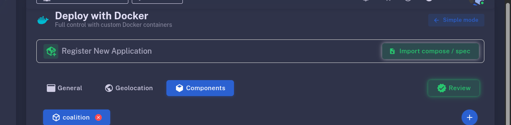

# Registering the Coalition as a Flux App — click by click

The Coalition is deployed on the Flux network as an **Enterprise** app. This page is
onboarding **Step 4** with pictures; the reasoning (why Enterprise is not optional, what
`env.json` contains, how to verify) is in
[operator-onboarding.md → Step 4](operator-onboarding.md#step-4--deploy-the-coalition-on-flux).

You need two files from your agent directory, both written by `fh-toolkit`:

| file | written by | what it is |
|---|---|---|
| `flux-app-spec.json` | `fh-toolkit init` | the app spec: image, ports, resources, **no environment** |
| `env.json` | `fh-toolkit env` | the environment: config + secrets + your signed manifest |

Your app's URL is deterministic — `https://<app name>.app.runonflux.io/` where the app
name is the `name` in `flux-app-spec.json` (`coalition-<your slug>`). That is the
`COALITION_URL` in `config.env`, and it is known before the app exists, which is why the
Stripe webhook (Step 3) can be registered first.

The screenshots show a provider called `cute-dogs`; yours will show your own slug.

---

## 1. Start from an import, not the form

Go to <https://cloud.runonflux.com> and log in with your wallet (or email). Click
**Register New App** → **Deploy with Docker**, then the **Import it →** link under the
title rather than filling in the container form.



## 2. Paste `flux-app-spec.json`

Open `flux-app-spec.json` from your agent directory and paste its contents into the
Import box, then click **Import**. Review it first: the `description` lines are what
FluxOS shows for the app, `repotag` must be `w2vy/coalition:latest`, and
`environmentParameters` is `[]` — the environment is added in step 7, not here.



## 3. Enterprise on; pick a term

Scroll down to **Additional Options** and switch **Enterprise** on. This encrypts the
app spec so the secrets you are about to add (Stripe key, signing key) are readable only
by the nodes running your app — a plain Flux app's environment is world-readable.

Above it, **Period** defaults to **1 week**. Pick a month or longer: the app expires at
the end of the term and a lapsed Coalition means no manifest, no stats and no checkout
until you redeploy. Longer terms are also discounted.



## 4. Open the component

The environment belongs to the component, not the app. Switch to the **Components**
tab and click the **coalition** component to open it.



## 5. Scroll to Environment

Inside the component scroll down to **Environment** and click **Environment Variables**.



## 6. Import from JSON

On the blue **Environment Variables** bar, the icon at the right is **Import from JSON**.
Do not add variables one by one — `MANIFEST_JSON` alone is far over what the form
accepts by hand.



## 7. Paste `env.json`

Open `env.json` (written by `fh-toolkit env` beside `config.env`), paste it, click
**Import**. It is a JSON array of `"KEY=value"` strings and it **contains your secrets**
— this dialog is the only place it should ever be pasted.



## 8. Upload to Flux Cloud

With the variables loaded, the table header shows a **cloud** icon. Click it. The
environment is larger than a spec can carry inline (Flux caps one plaintext parameter at
400 characters and `MANIFEST_JSON` is several thousand), so it is stored encrypted in
Flux Cloud and the spec carries a reference.



## 9. Save into the spec

Click **Save** on the Environment Variables dialog to write the environment into the
app spec.



## 10. Review, pay, deploy

Scroll back to the top and click **Review**. Follow the steps to sign with your wallet
and pay for the term. The app appears under **My Applications**; allow a few minutes for
nodes to pick it up.



---

## Then verify

```sh
curl -s https://coalition-<slug>.app.runonflux.io/health
# {"ok":true,"provider":"<slug>","coalitionVersion":"…"}
fh-toolkit doctor --check-hub        # reports the deployed Coalition build
```

A `503` from the Flux edge before the app is placed is normal for the first minutes;
only an `x-coalition-version` header proves your container answered.

## Changing the environment later

Rotating a secret, changing tiers, or re-signing the manifest is the same steps 4–9 on
the existing app (My Applications → your app → Update), with a fresh `env.json`, then
Flux's **Free Deploy**. A change that touches only secrets can leave the spec
byte-identical, in which case the redeploy is a silent no-op — verify with `/health`
or a real checkout rather than trusting the import.
