# Stripe setup for Flux Hub Operators

This is the click-by-click companion to **Step 3** of
[`operator-onboarding.md`](operator-onboarding.md). It produces the two values
`secrets.env` needs before `fh-toolkit env` will emit a paid tier:

```
STRIPE_SECRET_KEY=rk_test_...
STRIPE_WEBHOOK_SECRET=whsec_...
```

Supporters do not need any of this — there is nothing for sale. Come back here when you
upgrade to Operator.

## Before you start

- **Open a Stripe account** at <https://dashboard.stripe.com/register>. You are the
  merchant of record; Flux Hub never holds these credentials.
- **Know your Coalition URL.** It is deterministic —
  `https://<yourFluxAppName>.app.runonflux.io` — and you chose the app name in Step 1,
  so you can register the webhook before the app is deployed. The examples below use
  `https://coalition-cute-dogs.app.runonflux.io`.
- **You do not create Products or Prices by hand.** The first checkout for a tier makes
  the Coalition create a Product (`Flux Hub <TIER> (<slug>)`) and a monthly Price from
  the tier price you declared, keyed by a deterministic `lookup_key`, and reuse them
  after that. The Product is created in the **Infrastructure as a service (IaaS) -
  business use** tax category, which is non-taxable in the US. If you see a product
  under *Preset: General - Electronically Supplied Services* in **Product catalog**, it
  was created by an older Coalition — open it and set the category to IaaS yourself.

## 1. Enable Test mode and create a sandbox

Flip the dashboard to **Test mode** and create a new **sandbox**. Everything you mint
while in Test mode carries `test` in its name (`rk_test_…`, `whsec_…` under a test
endpoint), so you can always tell which mode a value came from. The live key is a
separate key you create the same way once you go live.

## 2. Create a restricted API key

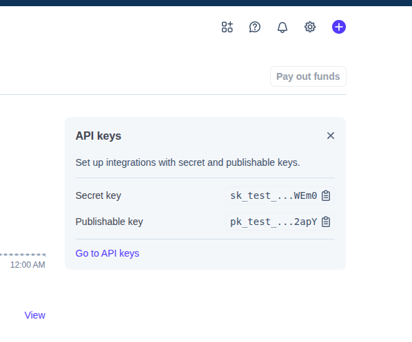

You will see your **unrestricted** keys first. **Do not use these.** A standard secret
key (`sk_…`) can move money and read your whole account — exactly what the Coalition
must never hold. Instead go to **Settings (gear) → Developers → API keys**.

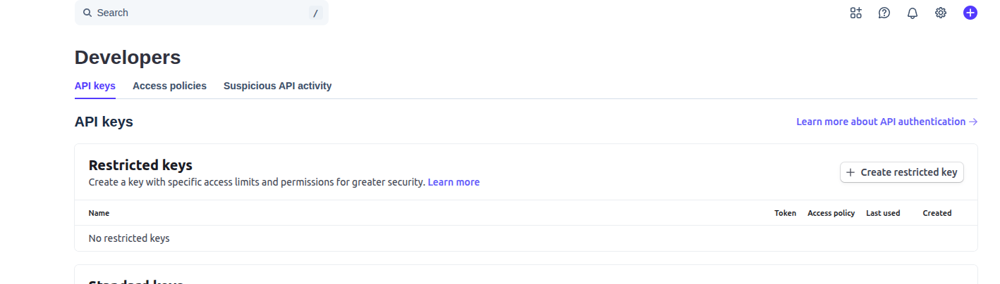

Click **Create restricted key**.

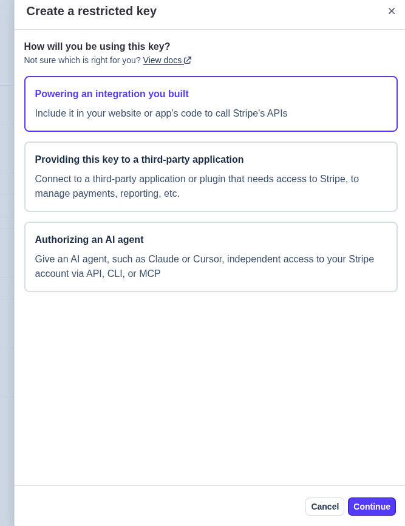

Choose **Powering an integration we built**, then **Continue**.

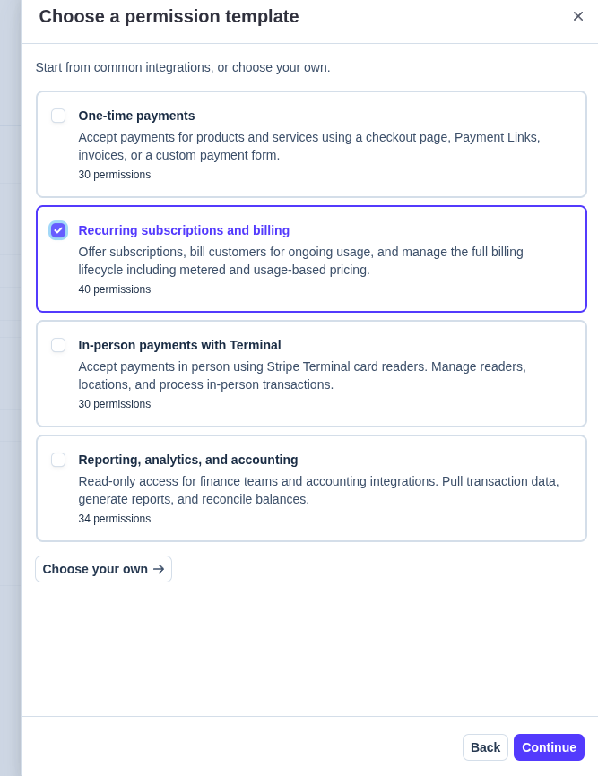

Choose **Recurring subscriptions**, then **Continue**. This preset grants everything the
Coalition and `fh-toolkit doctor --check-stripe` need and nothing that can refund or pay
out — no manual permission editing required.

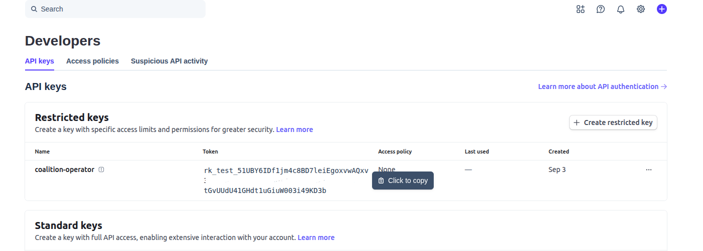

Mouse over the `rk_test_…` value and click the copy button that appears. Save it in
`secrets.env`:

```
STRIPE_SECRET_KEY=rk_test_...
```

## 3. Create the webhook

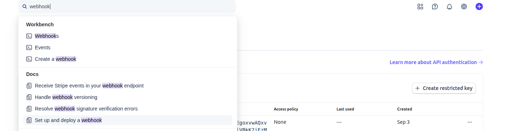

Still under **Developers**, find **Webhooks** and click **Create a webhook**.

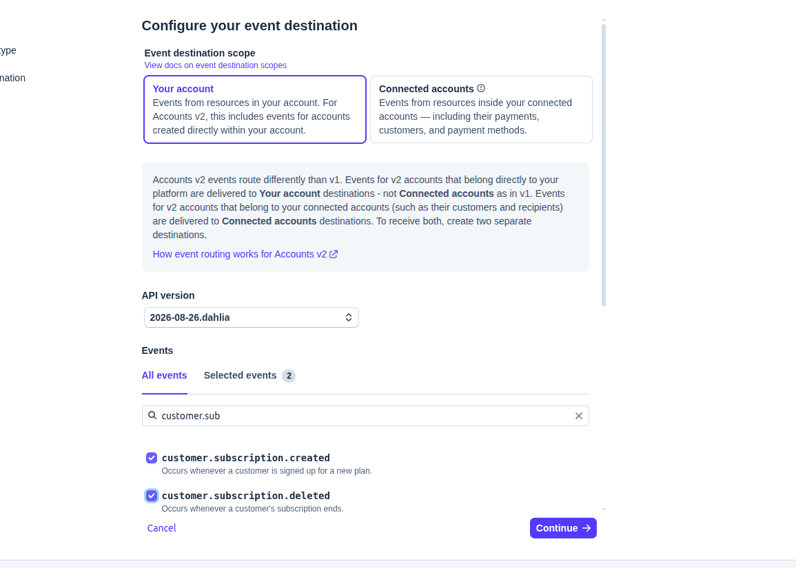

Select **Your account**. You will add **five** events. In the search box type
`customer.sub` and enable both:

- `customer.subscription.created`
- `customer.subscription.deleted`

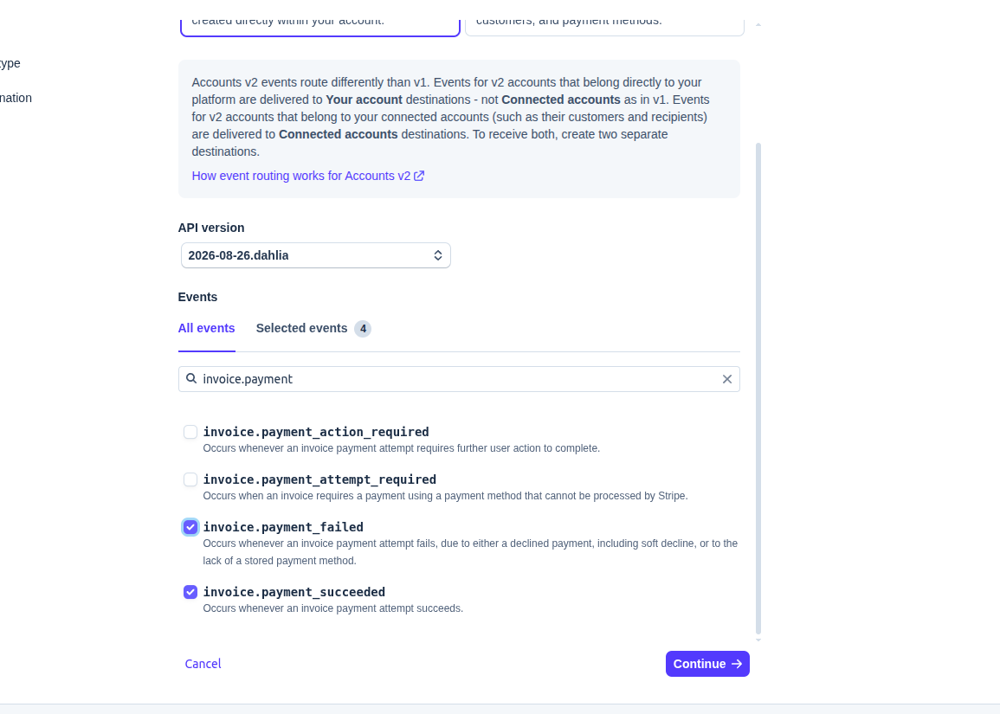

Next search `invoice.payment` and select both:

- `invoice.payment_failed`
- `invoice.payment_succeeded`

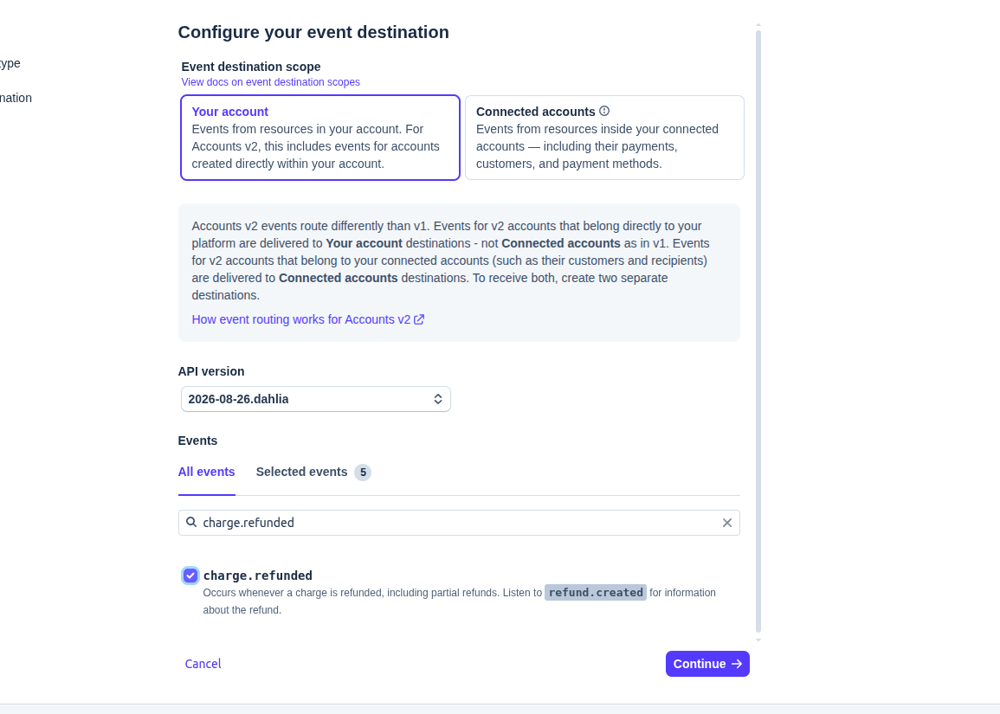

Next search `charge.refunded`, select it, and click **Continue**.

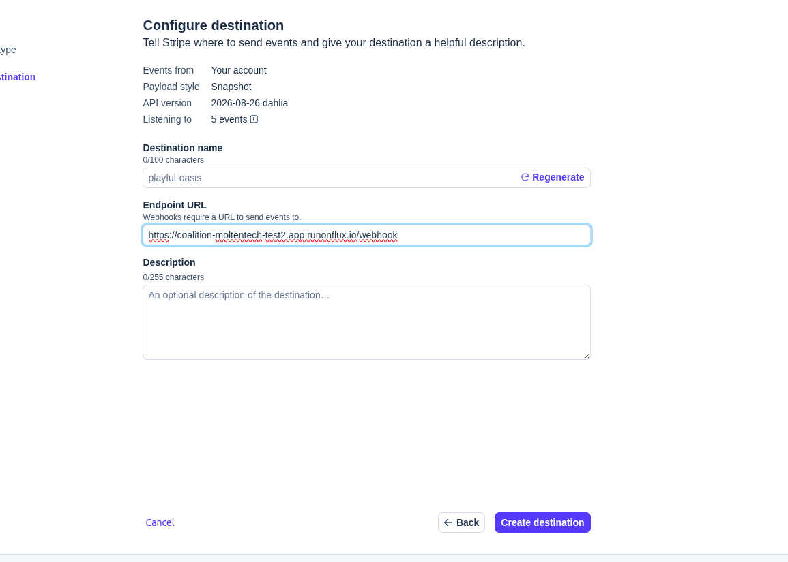

Set the **Endpoint URL** to `https://<yourFluxAppName>.app.runonflux.io/webhook` — your
Coalition URL plus `/webhook` — then click **Create destination**.

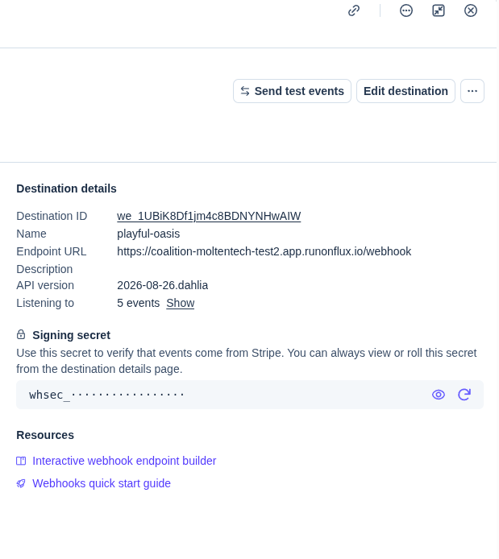

You are shown the webhook **signing secret**. Click the eye icon to reveal it, then click
it to copy. Save it in `secrets.env`:

```
STRIPE_WEBHOOK_SECRET=whsec_...
```

⚠️ A `whsec_` is bound to the endpoint URL it was created for. If you ever change the
app name, create a new endpoint and take its new secret — do not reuse this one.

## 4. Verify

```
fh-toolkit doctor --check-stripe
```

This confirms the key is yours, the endpoint points at *your* Coalition, and key mode
and endpoint mode agree (test with test, live with live). See
[`fh-toolkit.md`](fh-toolkit.md) for what each `STRIPE_*` finding means. Then continue
with **Step 4 — Deploy the Coalition** in
[`operator-onboarding.md`](operator-onboarding.md).
